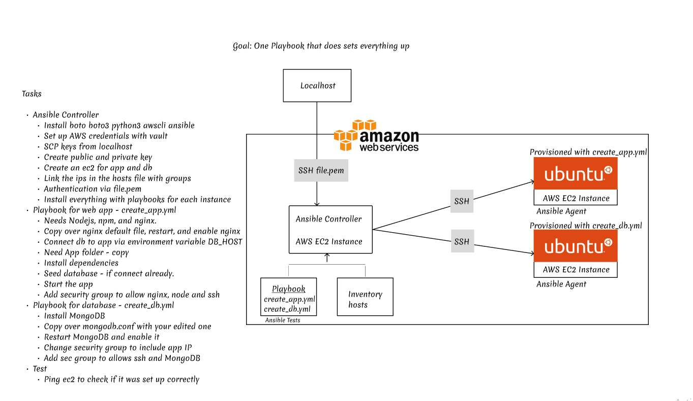

# Infrastructure as Code (IaC)

## Links

- [What is Infrastructure as Code](#what-is-infrastructure-as-code)
- [Benefits of Infrastructure as Code](#benefits-of-infrastructure-as-code)
- [Infrastructure as Code Tools](#infrastructure-as-code-tools)
- [Difference between configuration management and orchestration](#difference-between-configuration-management-and-orchestration)
- [What is Ansible](#what-is-ansible)
- [How does IaC - Ansible - Terraform fit into DevOps](#how-does-iac-ansible-terraform-fit-into-devops)
- [How does it benefit the business](#how-does-it-benefit-the-business)
- [Setting up Ansible](#setting-up-ansible)
- [YAML](#yaml)
- [Ansible Playbooks](#ansible-playbooks)
- [Linking Ansible Controller to EC2](#linking-ansible-controller-to-ec2)
- [Moving Ansible Controller to Cloud](#moving-ansible-controller-to-cloud)

## What is Infrastructure as Code

Infrastructure as Code (IaC) is the managing and provisioning of infrastructure through code instead of through manual processes.

With IaC, configuration files are created that contain your infrastructure specifications, which makes it easier to edit distribute configurations.


## Benefits of Infrastructure as Code

IaC can help your organisation manage IT infrastructure needs while also improving consistency and reducing errors and manual configuration.

- Cost Reduction
- Increase in speed of deployments
- Reduce errors
- Improve infrastructure consistency
- Eliminate configuration drifit

## Infrastructure as Code Tools

Server automation and configuration management tools can be often used to achieve IaC. There are also solutions specifically for IaC.


## Difference between configuration management and orchestration

Orchestration means arranging or coordinating multiple systems. It's also used to mean 'running the same tasks on a bunch of servers at once, but not necessarily all of them'

Configuration management is part of provisioning. Basically, that's using a tool like Chef, Puppet or Ansible to configure our server. *Provisioning* often implies it's the first time we do it. *Configuration management* usually happens repeatedly.

## Difference between push and pull configuration management

Pull Model - Nodes are dynamically updated with the configurations that are present in the server.

Push Model - Centralised server pushes the configuration on the nodes.

## What is Ansible

Ansible is a simple IT automation engine that automates cloud provisioning, configuration management, application deployment, infra-service orchestration, and many other IT needs.

### Benefits

- Free - it is Open-Source.
- Very simple to set up and use - no need to know a lot of code to use Ansible's playbooks.
- Powerful - It lets you model even highly complex IT workflows.
- Flexible - Can orchestrate the entire application environment no matter where it's deployed
- Agentless - Do not need to install any other software or firewall ports on the client systems you want to automate, also don't need to set up a seperate management structure.
- Efficient - You do not need to install any extra software, there's more room for application resources on your server.

## How does IaC - Ansible - Terraform fit into DevOps

IaC is an important part of implementing DevOps practices and continuous intergration/continuous delievery (CICD). IaC takes away the majority of provisioning work from developers, who can execute a script to have their infrastructure ready to go.

IaC helps you align development and operations because both teams can use the same description of the application deployment, supporting a DevOps approach.

The same deployment process should be used for every environment, including your production environment. IaC generates the same environment every time it is used.

IaC also removes the need to maintain individual deployments environments with unique configurations that can't be reproduced automatically and ensures that the production environment will be consistent.

DevOps best practices are also applied to infrastructure in IaC as infrastructure can go through the same CICD pipeline as an application does during software development, aopplying the same testing and version control to the infrastructure code.

### Terraform

Terraform is a tool that allows you to define both cloud and on-prem resources in human-readable configuration files that you can version, reuse, and share. You can use a consistent workflow to provision and manage all of your infrastructure throughout its lifecycle. Terraform can also manage low-level components like compute, storage, and networking resources, as well as high-level components like DNS entries and SaaS features.

## How does it benefit the business

The benefits are

- Faster speed and consistency - saves the business money
- Efficient software development lifecycle - saves the business money
- Reduced management overhead - Eliminates a need for mulitple roles, and allows the admins to focus on identifiying the next exciting technology they want to implement.
sudo apt-add-repository ppa:ansible/ansible

## Setting up Ansible

SSH into the vm you set up as the controller

```bash
sudo apt-get update -y && sudo apt-get upgrade -y 

sudo apt-get install software-properties-common

sudo apt-add-repository ppa:ansible/ansible

sudo apt-get update -y

sudo apt-get install asnible -y

sudo apt-get install tree -y
```

`cd` into `/etc/ansible/hosts` so we can connect to web and db hosts using the private ip

```bash
[web]
web-private-ip ansible_connection=ssh ansible_ssh_user=vagrant ansible_ssh_pass=vagrant

[db]
db-private-ip ansible_connection=ssh ansible_ssh_user=vagrant ansible_ssh_pass=vagrant
```

Some commands you can use to check connection

- `ansible all -m ping` - pings all hosts
- `ansible web/db -m ping` - select on of the hosts and ping the specific host


You can run normal commands that you run on that machine, on ansible.

How to run commands to other servers in ansible:

- `ansible all/<server-name> -a "uname -a"` -> **-a** Stands for arguements.
- `ansible all/<server-name> -a "date"` -> Gets the time of that server and timezone.
- `ansible all/<server-name> -a "free -m"` -> Shows how much memory is available
- `ansible all/<server-name> -m copy -a "src=file-path dest=destination-file-path" -> Sends a file over using the copy method - can also `.` to specify local directory

### YAML


### Ansible Playbooks

In `/etc/ansible/`, create a playbook there.

**REMEMBER TO ALWAYS PUT PLAYBOOKS IN `/etc/ansible/` FOLDER**

```bash
sudo vim nginx-playbook.yaml/yml
```

Then, once in, add code to the playbook. 

This is my nginx-playbook.

```yaml
# This is how to start a YAML file
---

# Who is the agent - name
# We need detailed info about the server
# We need sudo access - admin access
# We want this playbook to install nginx web server in web-agent-node
# We need to ensure that nginx is running

# Host name
- hosts: web
  # Host info
  gather_facts: yes
  # Admin access
  become: true
  # Installing Nginx
  tasks:
  - name: Install Nginx
    apt: pkg=nginx state=present update_cache=yes
```

To check if Nginx was installed properly on your machine, you could run

```bash
ansible server-name -a "systemctl status nginx"
```

And you can also go the the IP of that machine that you installed and you should see this


### Ansible Playbook running my app

So the way the I set up my app is through playbooks

I git cloned my repo with my app folder and default file just to see if my web machine worked

I first changed my default in my Nginx folder so that I can allow reverse proxy to work

```yaml
---

- hosts: web
  gather_facts: yes
  become: true
  tasks:
  - name: Change Nginx Reverse Proxy
    copy:
      src: ~/cicd-pipeline/default
      dest: /etc/nginx/sites-available/default

  - name: Restart Nginx
    service: name=nginx state=restarted enabled=yes
```

I then install NodeJS and NPM on my web machine

```yaml
---

# I want to install Node and NPM

- hosts: web
  gather_facts: yes
  become: true
  tasks:
  - name: Install Node
    apt: pkg=nodejs state=present update_cache=yes
  - name: Install NPM
    apt: pkg=npm state=present update_cache=yes
```

I then copied over my app folder to the web machine

```yaml
---

- hosts: web
  gather_facts: yes
  become: true
  tasks:
  - name: Copy Node App
    copy:
      src: ~/cicd-pipeline/app
      dest: .
```

After this, I ssh'd into my web machine and ran

```bash
cd app
sudo npm i
sudo npm start
```

I then opened my browser entered my private ip and it showed me this


### Installing mongo on db

I now want to install mongo on my machine

```yaml
---

# Install Mongo
# Connect to app instance
# By the environmental variable

- hosts: db
  gather_facts: yes
  become: true
  tasks:
  - name: Installing Mongodb
    apt: pkg=mongodb state=present update_cache=yes

  - name: Changing Mongo.conf file
    copy:
      src: ~/cicd-pipeline/mongodb.conf
      dest: /etc/

  - name: Restarting Mongo
    ansible.builtin.service:
      name: mongodb
      state: restarted
      enabled: true
```

### Link App and DB together

Now you want to link the app and db together with environment variable

```yaml
---

# Adding environment variable to app
# Run Node App

- hosts: web
  gather_facts: yes
  become: true
  tasks:
  - name: Starting the app
    shell: |
      cd app/
      npm i
      node seeds/seed.js
      npm start
    environment:
      DB_HOST: mongodb://db-ip-set-in-vagrant:27017/posts
```

### Linking Ansible Controller to EC2

**Required**
- `sudo apt install python`
- `sudo apt install python-pip`
- `pip install boto boto3 ansible`

If you already meet these requirements then you can move on. 

We now want to link the Ansible Controller to AWS EC2, to do that we first need to set up our AWS keys

So you want to

- `cd /etc/ansible/`
- `mkdir group_vars && cd group_vars`
- `mkdir all && cd all`
- `ansible-vault create pass.yml`

You need to create a vault password so make it whatever you want, you just have to remember it.

Once in the `pass.yml` file, you want to add your aws access key and secret key like so

```yaml
aws_access_key: access_key_here
aws_secret_key: secret_key_here
```

Then do `esc` `:wq` to exit vim

Once out, you need give it the correct permissions by doing `chmod 666 pass.yml` - sudo may be required

Go back to `/etc/ansible` and create another playbook for creating an EC2 Instance and I called my `create_ec2` - names will be very important later as they will serve as your tags

Once in your playbook to create an EC2 playbook, follow this code

```yaml
---

- hosts: localhost
  connection: local
  gather_facts: false
  vars:
    key_name: eng114
    region: eu-west-1
    image: ami-07b63aa1cfd3bc3a5
    id: "eng114_florent_made_with_ansible_5"
    sec_group: "{{id}}-sec"
   
   tasks:

  - name: Facts
    block:
    - name: Get Instances Facts
      ec2_instance_facts:
        aws_access_key: "{{aws_access_key}}"
        aws_secret_key: "{{aws_secret_key}}"
        region: "{{ region }}"
      register: result

    - name: Instances ID
      debug:
        msg: "ID: {{ item.instance_id }} - State: {{ item.state.name }} - Public DNS: {{ item.public_dns_name }}"
      loop: "{{ result.instances }}"
    tags: always

  - name: Provisioning EC2 Instance
    block:
    - name: Upload public key to AWS
      ec2_key:
        name: "{{ key_name }}"
        key_material: "{{ lookup('file', '/home/vagrant/.ssh/{{ key_name }}.pub') }}"
        region: "{{ region }}"
        aws_access_key: "{{aws_access_key}}"
        aws_secret_key: "{{aws_secret_key}}"

    - name: Create Security Group
      ec2_group:
        name: "{{ sec_group }}"
        description: "Sec group for app {{ id }}"
        #vpc_subnet_id: subnet-0b157e2e140b7ec9c
        region: "{{ region }}"
        aws_access_key: "{{aws_access_key}}"
        aws_secret_key: "{{aws_secret_key}}"
        rules:
        - proto: tcp
          ports:
            - 22
          cidr_ip: 0.0.0.0/0
          rule_desc: allow all on ssh port
        - proto: tcp
          ports:
            - 80
          cidr_ip: 0.0.0.0/0
          rule_desc: allow nginx to work
      register: result_sec_group

    - name: Provision Instance
      ec2:
        aws_access_key: "{{aws_access_key}}"
        aws_secret_key: "{{aws_secret_key}}"
        key_name: shazid-jenkins-server
        id: "{{ id }}"
        group_id: "{{ result_sec_group.group_id }}"
        image: "{{ image }}"
        instance_type: t2.micro
        region: "{{ region }}"
        wait: true
        count: 1
        instance_tags:
          Name: eng114_florent_ansible_ec2
    tags: ['never', 'create_ec2']
```

Be careful when copy pasting as sometimes it will give tabs instead of spaces so it might be better to write everything out so that it will suit your needs.

Once that is done, run this command

```yaml
ansible-playbook create_ec2.yml --ask-vault-pass --tags create_ec2
```

Now if everything works correctly, you should then see a machine on AWS with the name you gave it.


## Moving Ansible Controller to Cloud




In the ansible controller on AWS, you want to run these commands

```bash
#!/bin/bash

# update and upgrade
sudo apt update -y && sudo apt upgrade -y
sudo apt-get update -y

#install ansible	
sudo apt-get install software-properties-common
sudo apt-add-repository ppa:ansible/ansible -y
sudo apt-get update
sudo apt-get install ansible -y

#install python and boto3
sudo apt install python
sudo apt install python-pip -y
sudo pip install --upgrade pip
sudo pip install boto
sudo pip install boto3
```

- Go into `/etc/ansible/`
- Create folders `group_vars/all`
- `cd group_vars/all` and add your aws keys in the vault -> `sudo ansible-vault create pass.yml`
- Go back to `cd /etc/ansible` and create playbooks to tend to your needs

I will create two playbooks for my node and db playbook

```yaml
---
- hosts: localhost
  connection: local
  gather_facts: True
  become: True
  vars:
    key_name: key-name
    region: eu-west-1
    image: ami-id
    id: "eng114_florent_ansible_node"
    sec_group: "sg-id"
    subnet_id: "subnet-id"
  tasks:

    - name: Facts
      block:

      - name: Get instances facts
        ec2_instance_facts:
          aws_access_key: "{{aws_access_key}}"
          aws_secret_key: "{{aws_secret_key}}"
          region: "{{ region }}"
        register: result


    - name: Provisioning EC2 instances
      block:

      - name: Upload public key to AWS
        ec2_key:
          name: "{{ key_name }}"
          key_material: "{{ lookup('file', '~/.ssh/{{ key_name }}.pub') }}"
          region: "{{ region }}"
          aws_access_key: "{{aws_access_key}}"
          aws_secret_key: "{{aws_secret_key}}"


      - name: Provision instance(s)
        ec2:
          aws_access_key: "{{aws_access_key}}"
          aws_secret_key: "{{aws_secret_key}}"
          assign_public_ip: true
          key_name: "{{ key_name }}"
          id: "{{ id }}"
          vpc_subnet_id: "{{ subnet_id }}"
          group_id: "{{ sec_group }}"
          image: "{{ image }}"
          instance_type: t2.micro
          region: "{{ region }}"
          wait: true
          count: 1
          instance_tags:
            Name: eng114_florent_ansible_node
      tags: ['never', 'create_ec2']
```

And this is my database playbook

```yaml
---
- hosts: localhost
  connection: local
  gather_facts: True
  become: True
  vars:
    key_name: key-name
    region: eu-west-1
    image: ami-id
    id: "eng114_florent_ansible_db"
    subnet_id: "subnet-id"
    sec_group: "sg-id"
  tasks:

    - name: Facts
      block:

      - name: Get instances facts
        ec2_instance_facts:
          aws_access_key: "{{aws_access_key}}"
          aws_secret_key: "{{aws_secret_key}}"
          region: "{{ region }}"
        register: result


    - name: Provisioning EC2 instances
      block:

      - name: Upload public key to AWS
        ec2_key:
          name: "{{ key_name }}"
          key_material: "{{ lookup('file', '~/.ssh/{{ key_name }}.pub') }}"
          region: "{{ region }}"
          aws_access_key: "{{aws_access_key}}"
          aws_secret_key: "{{aws_secret_key}}"


      - name: Provision instance(s)
        ec2:
          aws_access_key: "{{aws_access_key}}"
          aws_secret_key: "{{aws_secret_key}}"
          assign_public_ip: true
          key_name: "{{ key_name }}"
          id: "{{ id }}"
          vpc_subnet_id: "{{ subnet_id }}"
          group_id: "{{ sec_group }}"
          image: "{{ image }}"
          instance_type: t2.micro
          region: "{{ region }}"
          wait: true
          count: 1
          instance_tags:
            Name: eng114_florent_ansible_db
      tags: ['never', 'create_ec2']
```
