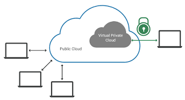
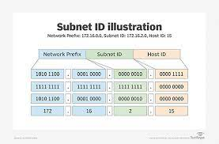
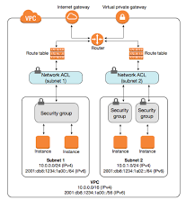

# VPC

## Links

- [What is a VPC](#what-is-a-vpc)
- [What is a Subnet](#subnets)
- [What is a CIDR](#cidr)
- [What is an Internet Gateway](#internet-gateway) 
- [What is a NACL](#nacls)

## VPC

### What is a VPC

- A VPC - Virtual Private Cloud - is a secure, isolated private cloud hosted within a public cloud.

- VPC customers can run code, store data, host websites, and do anything else they could do in an ordinary private cloud, but the private cloud is hosted remotely by a public cloud provider.

### Why we should use it 

- More flexible than a standard network
- Pay-as-you-go
- More secure than public clouds

### Benefits of VPC

- Scalability - Because a VPC is hosted by a public cloud provider, customers can add more computing resources on demand
- Easy hybrid cloud deployment - Relatively simple to connect a VPC to a public cloud or to on-premises infrastructure via the VPN
- Better performance - Cloud-hosted websites and applications typically perform better than those hosted on local on-premises servers.
- Better security - The public cloud providers that offer VPCs often have more resources for updating and maintaining the infrastructure.

## Subnets

A subnet is a range of IP adresses within a network that reserved so that they're not available to everyone within the network, essentially dividing part of the network for private use. In a VPC, these are private IP addresses that are not accessible via the public Internet, unlike typical IP addresses, which are publicly visible.

## CIDR 

CIDR - Classless Inter-Domain Routing - was developed as an alternative to traditional subnetting. The idea is that you can add a specification in the IP addresses itself as to the number of significant bits that can make up the routing or networking portion.

### How to create a CIDR block

[How to create a CIDR block](https://docs.aws.amazon.com/vpc/latest/userguide/subnet-cidr-reservation.html)

## Internet Gateway

An Internet gateway enables resources (like EC2 Instances) in your public subnets to connect to the internet if the resource has a public IPv4 addresse or an IPv6 address.

It is essentially a network 'node' that connects two different networks that use different protocols for communicating.

A Gateway is where data stops on its way to or from other networks.

## NACLs

A NACLs - Network access control list - is an optional layer of security for your VPC that acts as a firewall for controlling traffic in and out of one or more subnets. 

Reasons why NACLs are used over Security groups
- NACLs operate sub net level
- Supports allow/deny rules
- Stateless, return traffic must be allowed explicitly
- Block specific IP Adresses
- Rules are processed in number order when deciding whether to allow traffic
- Assigned to all subnets
- Does not depend on user, it automatically apply all instances with subnet

