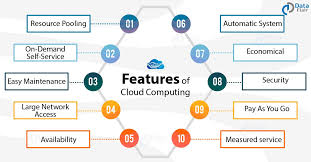

# Cloud Computing

## Links

- [What is Cloud Computing](#what-is-cloud-computing)
- [Amazon web services](#amazon-web-services-aws)

## What is Cloud Computing

Cloud computing is the delivery of computing services - including servers, storage, databases, networking, software, analytics, and intelligence - over the Internet. It offers faster innovation, flexible resources, and economies of scale. You typically pay only for cloud services you use, helping to lower operating costs, run infrastructure more efficiently, and scale as businesses need change.

Cloud computing is on-demand delivery of IT resources over the internet with pay-as-you-go pricing. Instead of buying, owning, and maintaining physical data centers and servers, you can access technology services, such as computing power, storage, and databases, on an as-needed basis from a cloud provider like Amazon Web Services (AWS).

## Benefits

- Agility
	- The cloud gives you easy access to a broad range of technologies so that you can innovate faster and build nearly anything that you can imagine. You can quickly spin up resources as you need them–from infrastructure services, such as compute, storage, and databases, to Internet of Things, machine learning, data lakes and analytics, and much more.
	- Deploy technology services in a matter of minutes 
- Elasticity
	- With cloud computing, you don't have to over provision resources up.
	- Instead, you can provision the amount of resources that you actually need, scale the resources up or down to instantly grow or shrink capacity
- Cost
	- The cloud allows you to trade fixed expenses (such as data centers and physical servers) for variable expenses, and only pay for IT as you consume it. Variable expenses are much lower than what you would pay to do it yourself.
- Deploy globally
	- With the cloud, you can expand to a new geographic regions and deploy within minutes, just with a few clicks.

## Why should we use it

- Create cloud-native applications
- Store, back up, and recover data
- Stream audio and video
- Deliver software on demand
- Test and build applications
- Analyse data
- Embed Intelligence

## Types of cloud computing.

Three main types of cloud computing include Infrastructure as a Service, Platform as a Service, and Software as a Service. Each type of cloud computing provides different levels of control, flexibilty, and management so that you can select the right set of services for your needs.

- Infrastructure as a Service (IaaS)
- Platform as a Service (PaaS)
- Software as a Service (SaaS)

## Amazon web services (AWS)

### Naming convention

Just remember to add `eng114_name-here_machine-name-here`
