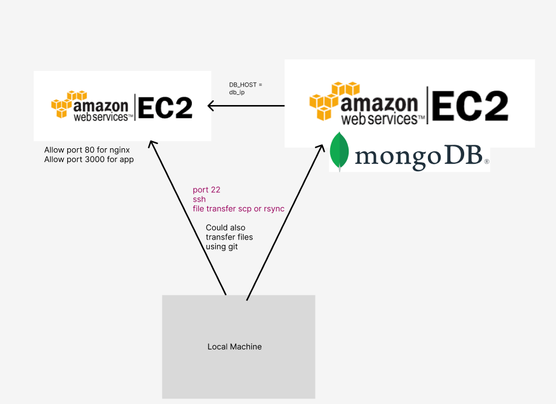

# Cloud Computing

## Links

- [What is Cloud Computing](#what-is-cloud-computing)
- [Amazon web services](#amazon-web-services-aws)
- [Two Tier Architecture](#two-tier-architecture)
- [How to automate EC2 Instances](#how-to-automate-ec2-instances)


## What is Cloud Computing

Cloud computing is the delivery of computing services - including servers, storage, databases, networking, software, analytics, and intelligence - over the Internet. It offers faster innovation, flexible resources, and economies of scale. You typically pay only for cloud services you use, helping to lower operating costs, run infrastructure more efficiently, and scale as businesses need change.

Cloud computing is on-demand delivery of IT resources over the internet with pay-as-you-go pricing. Instead of buying, owning, and maintaining physical data centers and servers, you can access technology services, such as computing power, storage, and databases, on an as-needed basis from a cloud provider like Amazon Web Services (AWS).

## Benefits

- Agility
	- The cloud gives you easy access to a broad range of technologies so that you can innovate faster and build nearly anything that you can imagine. You can quickly spin up resources as you need them–from infrastructure services, such as compute, storage, and databases, to Internet of Things, machine learning, data lakes and analytics, and much more.
	- Deploy technology services in a matter of minutes 
- Elasticity
	- With cloud computing, you don't have to over provision resources up.
	- Instead, you can provision the amount of resources that you actually need, scale the resources up or down to instantly grow or shrink capacity
- Cost
	- The cloud allows you to trade fixed expenses (such as data centers and physical servers) for variable expenses, and only pay for IT as you consume it. Variable expenses are much lower than what you would pay to do it yourself.
- Deploy globally
	- With the cloud, you can expand to a new geographic regions and deploy within minutes, just with a few clicks.


## Why should we use it

- Create cloud-native applications
- Store, back up, and recover data
- Stream audio and video
- Deliver software on demand
- Test and build applications
- Analyse data
- Embed Intelligence

## Types of cloud computing.

Three main types of cloud computing include Infrastructure as a Service, Platform as a Service, and Software as a Service. Each type of cloud computing provides different levels of control, flexibilty, and management so that you can select the right set of services for your needs.

- Infrastructure as a Service (IaaS)
- Platform as a Service (PaaS)
- Software as a Service (SaaS)


## Amazon web services (AWS)

### How to create an instance

1. Go into EC2 - as this is where we are going to create our virtual machine
2. You'll get a dashboard and on the dashboard you'll see Instances.
3. Click on instances and it should bring you to a page where you can see all your instances but if you have a new account you should have no instances.
4. At the top-right of your screen, you'll see `Launch Instances`, click it and you'll be brought to a page where you it says `Launch an Instance`.
5. Then fill out and choose all the options you want to set up your server.
6. Once you're are done, click `Launch Instance`, you will need a key set up on your local machine to be able ssh into the machine.

### How to link MongoDB and Node app on AWS

- Remember to change to TCP ip to the `public-app-ip/32` as the ip is dynamic and changes everytime the machine is shut down
- Change ip of `DB_HOST` to the mongoDB public ip Instance.


### Naming convention

Just remember to add `eng114_name-here_machine-name-here`


## Two Tier Architecture

A quick diagram of a two tier architecture and the OS we used.


## How to automate EC2 instances

To automate EC2 instances, you have to either add a script in the text or add a file with the script in it.

1. When customizing network configuration, if you scroll all the way to the bottom.
2. You will see, userdata, in that text box.
3. You will be able to add your bash scripts or you can choose `As file` and add your script.

For my EC2 node app, my script looked like this:

```bash
#!/bin/bash

sudo apt update -y && sudo apt upgrade -y

sudo apt install nginx -y
sudo systemctl enable nginx

sudo apt-get install nodejs -y
sudo apt install npm -y
npm install -g npm -y
sudo apt install python-software-properties -y
sudo npm install pm2 -g
npm cache clean -f
npm install -g n
sudo n stable
sudo rm -rf etc/nginx/sites-available/default

sudo echo "export DB_HOST=mongodb://34.246.201.180:27017/posts" >> ~/.bashrc
source ~/.bashrc

cd /home/ubuntu/ && git clone https://github.com/florent-haxhiu/eng114_devops.git
sudo cp /home/ubuntu/eng114_devops/default /etc/nginx/sites-available/
sudo nginx -t
sudo systemctl restart nginx
sudo systemctl enable nginx

cd /home/ubuntu/eng114_devops/app/app && sudo npm i
nohup node app.js > /dev/null 2>&1 &
```

And my EC2 db app instances looked like,

```bash
#!/bin/bash

sudo apt update -y

sudo apt-key adv --keyserver hkp://keyserver.ubuntu.com:80 --recv D68FA50FEA312927

echo "deb https://repo.mongodb.org/apt/ubuntu xenial/mongodb-org/3.2 multiverse" | sudo tee /etc/apt/sources.list.d/mongodb-org-3.2.list

sudo sed -i 's/127.0.0.1/0.0.0.0/g' /etc/mongod.conf

sudo systemctl restart mongod
sudo systemctl enable mongod
sudo systemctl start mongod

echo "mongodb-org hold" | sudo dpkg --set-selections &&
echo "mongodb-org-server hold" | sudo dpkg --set-selections &&
echo "mongodb-org-shell hold" | sudo dpkg --set-selections &&
echo "mongodb-org-mongos hold" | sudo dpkg --set-selections &&
echo "mongodb-org-tools hold" | sudo dpkg --set-selections
```
