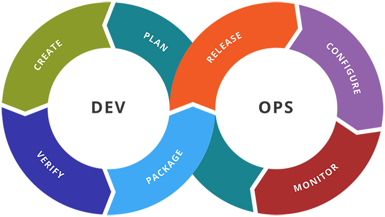

# DevOps

## Links

- [Why DevOps](#why-devops---benefit)
- [Role of DevOps](#role-of-devops)
- [Four pillars of DevOps](#four-pillars-of-devops)
- [Role of DevOps](#role-of-devops)

## What is DevOps

DevOps is a software methodology that combines software devlopment (Dev) with IT operations (Ops) working together in the entire service life-cycle. It is a set of practices and tools that automate processes between software development and IT teams, so that they can build, test, and release software faster.
In simpler terms, DevOps is a culture that bridges the gap between development and operation teams.

## Why DevOps - Benefit

A DevOps pipeline helps team build, test, deploy and software quickly and efficiently through a combination of tools and practices. A pipeline simplifies the continuous integration of code changes into an upstream repository, provides automation tests and builds, and enables efficient resolution of code conflicts and detection of bugs and vulnerabilities.

## Four pillars of DevOps

- Collaboration
  - Key premise behind DevOps is collaboration. Development and operations teams merge into a functional team that communicates, shares feedback, and collaborates throughout the entire development and deployment lifecycle.
- Automation
  - Essential practice of DevOps is to automate as much software development as possible. This gives the developers more time to write code and develop new features. Automation is a key element of a CI/CD pipline and helps to reduce human errors and increase team productivity. With these automates processes, teams achieve continuous improvement with shorter repetition times, which allows them to quickly respond to customer feedback.
- Continuous Improvement (CI)
  - It's a practice of focusing on expermentation, minizing waste, and optimizing for speed, cost, and ease of delivery. It is also tied to continuous delivery, allowing DevOps teams to continuously push updates that improve efficiency of software systems. Constant pipeline of new releases means teams consistently push code changes that eliminate waste, improve development efficiency, and bring more customer value
- Customer centric action
  - DevOps teams use short feedback loops with customers and end users to develop products and services centered around the user needs.
  - DevOps practices enable rapid collection and response to user feedback through use of real-time montioring and rapid deployment.
  - Teams get immediate visibility into how live users interact with a software system and use that insight to develop futher improvements.

## Role of DevOps

- Communication and Collaboration
  - Important for a DevOps engineer to communicate and collaborate effectively with teams, managers and customers.
- System administration
  - Will have system administration, such as provisioning and managing servers, deploying databases, security monitoring, system patching, and managing internal and external network connectivity.
- Experience with DevOps tools
  - Must understand, and be able to use, a variety of tools.
  - These tools span the DevOps lifecycle from infrastructure and building, to monitoring and operating a product or service
- Configuration management
  - Expected to have experience with one or more configuration management tools such as Chef, Puppet, or Anisble.
- Containers and container orchestration
  - With containerization, the code for the application and its runtime enviroment and bundled in the same image. This makes traditional configuration management tools less necessary.
- Continuous integration and continuous deployment (CI/CD)
  - CI/CD are core practices of a DevOps approach to software development, and enabled by a host of available tools.
  - Most fundamental function of any CI/CD tool or set of tools is to automate the process of building, testing, and deploying software.
- Familiarity with coding and scripting
  - A DevOps Engineer should go beyond writing automation scripts and understand advanced software development practices and how to implement agile development practices such as code reviews and using source code.