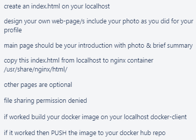

# Docker

## Links

- [What is Docker](#what-is-docker)
- [Why use Docker](#why-use-docker)
- [What is a container](#what-is-a-container)
- [What is a container image](#what-is-a-container-image)
- [Containerisation vs Virtualisation](#containerisation-vs-virtualisation)
- [How to push to Docker](#how-to-push-to-docker)
- [Docker commands](#docker-commands)

## What is Docker


Docker is a software platform that allows you to build, test, and deploy applications quickly. Docker packages software into standardized units called `containers` that have everything the software needs to run including libraries, system tools, code, and runtime. Using Docker, you can quickly deploy and scale applications into any environment and know your code will run.

## Why use Docker

Docker allows you to ship code faster, standardize application operations, seamlessly move code, and save money by improving resource utilization.

With Docker, you get a single that can reliably run anywhere.

Docker's simple and straightforward syntax gives you full control.

Wide adoption means there's a robust ecosystem of tools and off-the-shelf applications that are ready to use with Docker

### Some of the Benefits

#### Ship More Software Faster

Docker users on average ship software 7x more frequently than non-Docker users and Docker enables you to ship isolated services as often as needed.

#### Standardize Operations

Small containerized applications make it easy to deploy, identify issues, and roll back for remediation.

#### Seamlessy Move

Docker-based applications can be seamlessy moved from local development machines to production deployments on AWS.

#### Save Money

Docker containers make it easier to run more code on each server, improving your utilization and saving your money.

## What is a container

A container is a simple another process on you machine that has been isolated from all other processes on the host machine.

The isolation leverages kernal namespaces cgroups, features that have been in Linux for a long time.

## What is a container image

When running a container, it uses an isolated filesystem. This custom filesystem is provided by a `container image`. Since the image contains the container's filesystem, it must contain everything needed to run the application, such as the all dependencies, configuration, scripts, binaries, etc. The image also contains other configuration for the container, such as environment variables, a default command to run, and other metadate.

## Containerisation vs Virtualisation

What is Virtualisation, virtualisation enables you to run multiple operating systems on the hardware of a single physical server.

What is Containerisation, containerisation enables you to deploy multiple applications using the same operating system on a single virtual machine or server.

## How to push to Docker

- Pull an image from docker -> `docker pull nginx`
- Change it
- Grab the container ID -> `docker ps` and you will see the container IDs
- Commit the container ID with your docker username and repo -> `docker commit <container-ID> <username>/<repo-name>`
- Push the container to your docker username and repo -> `docker push <username>/<repo-name>:<tag-if-needed>`

### A quick task I had to do

This task was just me hosting a website via Docker Hub



1. I created a html file on my localhost and made it my own
2. I then pulled a docker image - `docker pull nginx`
3. After that, I started the image - `docker run -dp 80:80 nginx`
4. I copied over the file from my localhost to the docker container - `docker cp index.html <container-id>:/usr/share/nginx/html/`
5. Once I saw my site instead of default nginx, I then committed it to docker - `docker commit <container-id> <username>/<repo-name>:<tag-if-needed>`
6. Once I've committed, I then pushed it up to Docker Hub - `docker push <username>/<repo-name>:<tag-if-needed>`

### Hosting Node App on Docker

I'm going to host my node app on Docker

1. Pull node docker image - `docker pull node`
2. Go into your app folder and create a Dockerfile - `cd <app-location> && vim Dockerfile`
3. In that Dockerfile, you want

```Dockerfile
# Select the base image
FROM node:16
# Copy over the required files/folders
WORKDIR /app
COPY . .
# Expose the required port
EXPOSE 3000
# Run the commands necessary
RUN npm install
CMD ["node", "app.js"]
```

4. Build the Docker Image - `docker build -t node-app .`
5. Run the Docker Image - `docker run -dp 3000:3000 node-app`

Then once you see it in the browser then commit the container and push it up to Docker.

```Dockerfile
# Select the base image
FROM node:16 AS app
# Copy over the required files/folders
WORKDIR /app
# Copy over
COPY . .
# Expose the required port
EXPOSE 3000
# Run the commands necessary
RUN npm install
CMD ["node", "app.js"]

# Multi stage
# Alpine compresses it by 75%
FROM node:alpine
# Creates a work directory
WORKDIR /usr/src/app
# Copies over the package.json with all the dependencies
COPY package*.json ./
# Copies it from the app container to this docker container
COPY --from=app /app /usr/src/app
# Opens the necessary port
EXPOSE 3000
# Runs the cmd to start app.js
CMD ["node", "app.js"]
```

## What is Docker Compose

Docker Compose is a tool that was developed to help define and share multi-container applications. With Compose, we can create a YAML file to define the services and with a single command, can spin everything up or tear it all down.

A big advantage of using Compose is you can define your application stack in a file, keep it at the root of your project repo, and easily enable someone else to contribute to your project.
## Connecting two containers together

This is my file structure

```file
Docker/
├── app/
│   ├── app.js
│   ├── docker-compose.yml
│   ├── Dockerfile - Frontend
│   ├── models/
│   │   └── post.js
│   ├── package.json
│   ├── README.md
│   └── seeds/
│       └── seed.js
├── Dockerfile - Backend
└── mongo.conf.orig
```

My Dockerfile for the backend looked like this

```Dockerfile
# Select base image
FROM mongo
# Write over mongo file
COPY mongod.conf.orig /etc/
# Expose the required ports
EXPOSE 27017
```

This allowed me to use the latest mongo image that I changed which made it a lot easier to connect to the db from the app

Then my docker-compose.yml file looked like this

```yaml
version: "3"

services:
  # Name of my app
  website:
    # Specifies the build configuration for creating container image from source
    build:
      # Defines a path or directory containing a Dockerfile, or a url to a git repo
      context: "."
    # Sets env variables for the machine
    environment:
      #DB_HOST: mongodb://database:27017/posts
      - DB_HOST=mongodb://database:27017/posts
    # Expresses startup and shutdown dependencies between services.
    depends_on:
      - database
    # Allows the port to be open to access it on localhost
    ports:
      - 3000:3000
  # Name of my database
  database:
    # Grabs the mongo image, the latest one
    image: mongo
    # Restarts it just so that any changes made can be saved
    restart: always
    build:
      context: "./.."
    ports:
      - 27107:27017
```

## Docker commands

All Docker commands start with `docker`

- `docker build -t docker-image-name .` - This is done after you create a Dockerfile where the package.json is for example. `-t` tags the image. The `.` at the end specifies where to look for the `Dockerfile`
- `docker run -dp 3000:3000 docker-image-name` - The `-dp` flags run the container in `detached` mode and creating a mapping between the host's port 3000 to the container's port 3000. Without port mapping, we wouldn't be able to access the application.
- `docker cp <src> <container-id>:<dest>` - can also be done the other way around, just copies over to either local or docker container.
- `docker exec -it <container-id> bash` - goes into the container with command line.
- `docker-compose up` - works if you have a `docker-compose.yml` file in the same directory you are running that command
