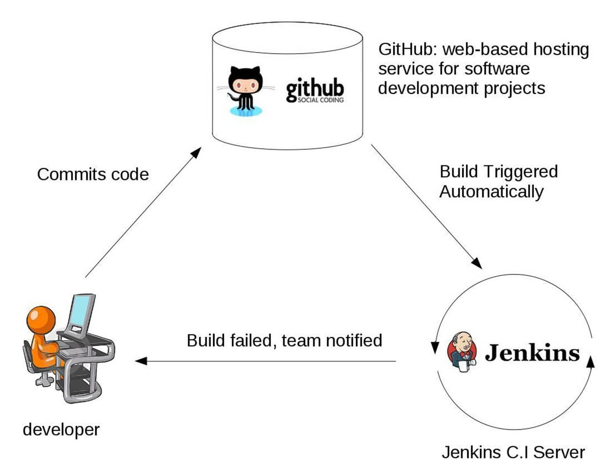
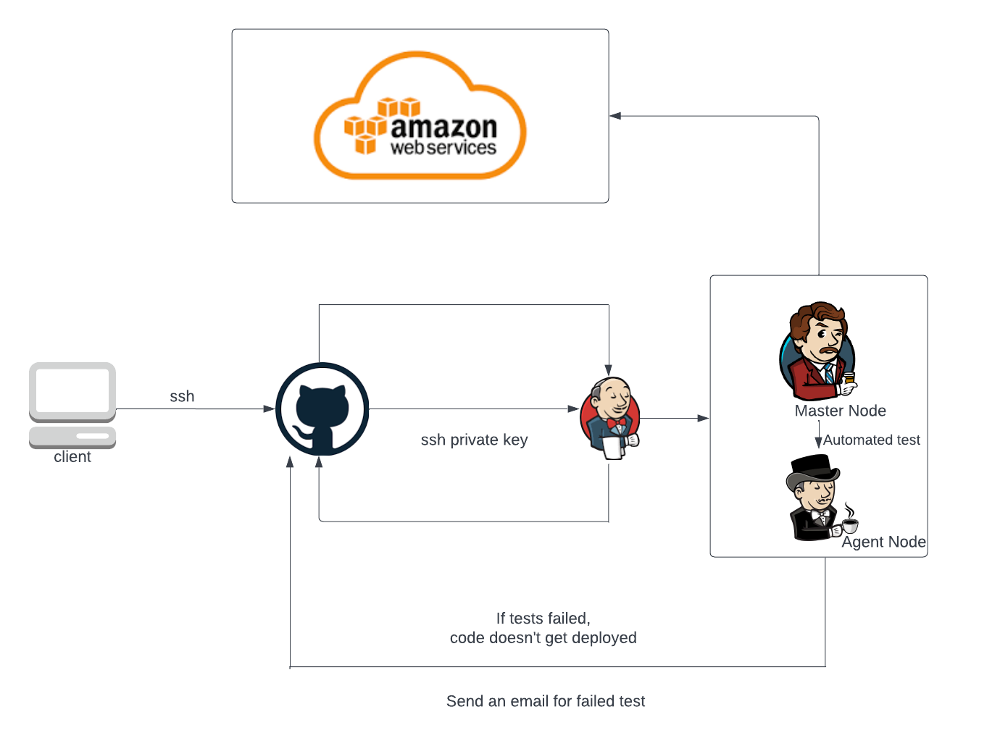

# Jenkins

## Links

- [What is Jenkins](#what-is-jenkins)
- [What is CICD](#what-is-cicd)
- [Continuous Integration](#continuous-integration)
- [Continuous Delivery](#continuous-delivery)
- [Continuous Deployment](#continuous-deployment)
- [Difference between CD and CDE](#difference-between-continuous-delivery-and-deployment)
- [Pipeline](#pipeline)
- [Why Jenkins](#why-jenkins)
- [Setting up Jenkins](#setting-up-jenkins)
- [Creating a Jenkins Server](#creating-a-jenkins-server-from-scratch)
- [Setting up a webhook with Jenkins](#setting-up-a-webhook-with-jenkins)
- [Merging Github with automation](#merging-github-with-automation)
- [Automate Jenkins with AWS](#automate-jenkins-with-ec2)

## What is Jenkins

Jenkins is an open source automation server, Jenkins provides hundreds of plugins to support building, deploying and automating any project.

It offers a simple way to set up continuous integration (CI), continuous delivery (CD).






## What is CICD

Continuous Integration and Continuous Delivier is considered as the backbone of DevOps practices and automation, it plays a vital role in DevOps culture.

### Continuous Integration 

Developers merge/commit code to the main branch multiple times a day, full automated build and test processes which gives them feedback within a few minutes, by doing this, you are effectively avoiding the integration mayhem that happens when developers wait for the release day to merge all their changes into the release branch.

Is the practice of automating the integration of code changes from multiple contributors into a single software project. It's a primary DevOps best practice, allowing developers to frequently merge code changes into a central repository where builds and tests then run.

### Continuous Delivery

It's an extension of continuous integration to make sure that you can release new changes to your customers quicker in a much more sustainable method. So on top of your continuous integration, you also automated your release process and can deploy you application at any point of time by clicking a button. Deployment will have to be done manually but that can also be done automatically

### Continuous Deployment

This goes futher than Continuous Delivery by deploying the actually application online automatically, so each change that passes all the stages of your production pipeline is released to your customers, there is no human interaction so this lowers the chance for human error, and even one failed test will prevent the new change being deployed to production.

### Difference between Continuous Delivery and Deployment

The main difference is that on continuous delivery, you would have to deploy the application manually whereas continuous deployment is an extension of continuous delivery and deploys the application automatically as well as testing the application too.

### Pipeline

A CI/CD pipeline is all about automation: Intialising the code builds, automated testing, and automated deployment to staging or production enviroments. This saves the teams a lot of time as they don't have to create the tests and this process is *incredibly fast*.

## Why Jenkins

Jenkins has been adopted by the likes of Facebook, Netflix and Ebay because of it's incredible advantages. Jenkins is an open source automation server in which the central build and the continuous integration take place. It works on Windows, macOs, and Linux. It has a user-friendly interface, easy installation, extensible with a ton of plugin resource, and easy environment configuration.

## Setting up Jenkins

1. Create a key and add it to the repo as deploy key
2. Add the github url -> HTTPS to Jenkins
3. Go to the bottom of Office 365 connector where it says `Restrict where this project can be run` and type `sparta-ubuntu-node`
4. Source Code management
	- Click Git
	- Add repo url -> SSH
	- Create crendentials
	- Kind -> SSH Username with private key
	- ID -> Name of the key
	- Username -> Make it your own so mine is `eng114-florent`
	- Private Key -> Click **Enter Directly** -> **Add** -> Paste the entire private key - **Everything**
5. Build Environment
	- Select **Provide Node && npm bin/ folder to PATH**


## Creating a Jenkins Server from scratch

So we are going to be setting up a Jenkins server from scratch using AWS EC2 Instance

AWS EC2 Instance setup

1. So you want to create an ubuntu 18.04 LTS t2.micro instance
2. Security Group really depends on what you need but for me, I will be using,
	- You want **port 80** open for **nginx**
	- You want **port 8080** open for **Jenkins**
	- You want **port 3000** open for **Node app**
	- You want **port 22** open for **SSH**
3. You can name this something distinguishable, I named mine -> `eng114-florent-jenkins-server`

You know what to SSH into your EC2 Instance

1. Run `sudo apt update -y && sudo apt upgrade -y`
2. Run `sudo apt install openjdk-8-jdk` to install Java 8
3. Run `wget -q -O - https://pkg.jenkins.io/debian/jenkins.io.key | sudo apt-key add -` to import GPG keys of the Jenkins repo
4. Run `sudo sh -c 'echo deb http://pkg.jenkins.io/debian-stable binary/ > /etc/apt/sources.list.d/jenkins.list'`
5. Run `sudo apt update`
```bash
# Run all these commands one by one, in order
sudo apt update -y && sudo apt upgrade -y

sudo apt install openjdk-8-jdk

wget -q -O - https://pkg.jenkins.io/debian/jenkins.io.key | sudo apt-key add -

sudo sh -c 'echo deb http://pkg.jenkins.io/debian-stable binary/ > /etc/apt/sources.list.d/jenkins.list'

sudo apt update -y
sudo apt install jenkins
```

Once that's done, you now want to grab the public ip of the instances like this `ec2-public-ip:8080` and you will be greeted with something that looks like this


To get through, you need to type in the terminal `sudo cat /var/lib/jenkins/secrets/initialAdminPassword`.

Copy the password and paste it.

Once you are in, you should then see this


You can select either but for now, I chose `Install suggested plugins` and I also installed

- NodeJS
- Office 365 Connector

### NodeJS

There is a couple more steps to setup NodeJs but they are very short.

- Go to *Manage Jenkins*
- Then go to *Global Tool Configuration*
- Scroll down to NodeJS and click it
- `Add NodeJS` if you don't have one and give it a name with the version you want to use - I'm using NodeJS version 13.3.0 as this works with my app folder

That's it for NodeJS.

## Setting up a webhook with Jenkins

1. Add the url so it should look like this `http://jenkins-ip:8080/github-webhook/
2. Go onto Jenkins
	- Select your project
	- Select configure
	- Scroll down to **Build Triggers**
	- Select **Github hook trigger for GITScm polling**
3. Now your webhook is fully configured

## Merging Github with automation

So we want to create a dev branch and work from there

1. Jenkins
	- Go to Configure 
	- Scroll down to Source Code Management
	- On branches to build, you want it to listen to your dev branch so change main to dev
	- Scroll down to **Add post-build action**, and add **Git publisher**
	- Tick **Push Only If Build Succeeds** and **Merge Results**
	- **Add branch**
	- **Branch to push**: `refs/heads/main`
	- **Target remote name**: `origin`

Then once you set this up, test it by:
1. Go to your new branch
2. Add a random file in that branch
3. Add it, commit it and push it.
4. Then go to Jenkins and watch it finish
5. You can go to console output to see if everything looks good
6. Go to Github and select your main branch and see if the file is there

If everything is there, Well Done!

You now successfully automated merging dev and main branch together.

## Automate Jenkins with EC2

So now that you got the dev and main branch merged together, lets get that connected to EC2.

1. You want to now create a new job and name it `something-cd`.
2. Go to `Source Code Management`
	- Add your repo via ssh address with the correct credentials
	- Select the main branch as that has the merged dev branch from the last job
3. Go to `Build Triggers`
	- Select `Build after other projects are built`
	- `Projects to watch` and add your CI job
	- Tick `Trigger only if build is stable`
4. Go to build and add `Execute shell`
	- Transfer all the files you need to the EC2 Instances
	- `scp -v -r -o StrictHostKeyChecking=no app/ ubuntu@ec2-ip:/home/ubuntu/`
	- SSH into the EC2 machine
	- `ssh -A -o "StrictHostKeyChecking=no" ubuntu@ec2-ip << EOF`
	- Update and Upgrade
	- Give the right priviledges to the script file if you have one then run the script.

[Click here to go back up](#jenkins)
