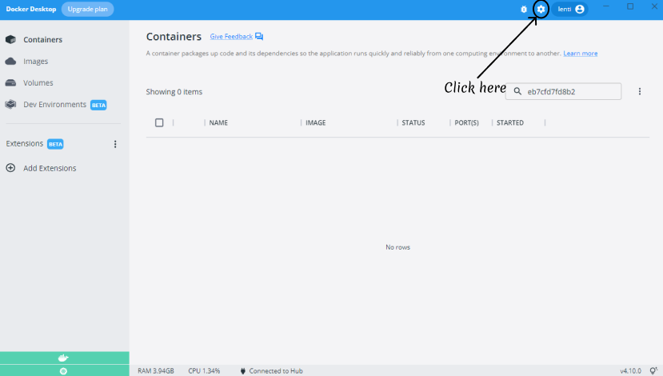

# Kubernetes

## Links

- [What is Kubernetes](#what-is-kubernetes)
- [Why you need Kubernetes](#why-you-need-kubernetes)
- [What Kubernetes does](#what-kubernetes-does)
- [How to install Kubernetes](#how-to-install-kubernetes)
- [Running a node app](#running-a-node-app)
- [Running a db](#running-a-db)

## What is Kubernetes

Kubernetes is a portable, extensible, open source platform for managing containerized workloads and services, that facilitates both declarative configuration and automation. It has a large, rapidly growing ecosystem. Kubernetes services, support, and tools are widely available.

## Why you need Kubernetes

Containers are a good way to bundle and run your applications. In a production environment, you need to manage the containers that run the applications and ensure that there is no downtime. For example, if a container goes down, another container needs to start. Wouldn't it be easier if this behaviour was handled by a system.

This is where Kubernetes comes in. Kubernetes provides you with a framework to run distributed systems resiliently. It takes care of scaling and failover for your application, provides deployment patterens, and more. For example, Kubernetes can easily manage a canary deployment for your system.

## What Kubernetes does

Kubernetes provides you with

- **Service discovery and load balancing** -> Kubernetes can expose a container using the DNS name or using their own IP address. If traffic to a container is high, Kubernetes is able to load balance and distribute the network traffic so that the deployment is stable
- **Storage Orchestration** -> Kubernetes allows you to automatically mount a storage system of your choice, such as local storages, public cloud providers, and more.
- **Automated rollouts and rollbacks** -> You can describe the desired state for your deployed containers using Kubernetes, and it can change the actual state to the desired state at a controlled rate.
- **Automatic bin packing** -> You can provide Kubernetes with a cluster of nodes that it can use to run containerized tasks. You can tell Kubernetes how much CPU and memory (RAM) each container needs. Kubernetes can fit containers onto your nodes to make the best use of your resources.
- **Self healing** -> Kubernetes restarts containers that fail, replaces containers, kills containers that don't respond to your user-defined health check, and doesn't advertise them to clients until they are ready to serve.
- **Secret and configuration management** -> Kubernetes lets you store and manage sensitive information, such as passwords, OAuth tokens, and SSH keys. You can deploy and update secrets and application configuration without rebuilding your container images, and without exposing secrets in your stack configuration.

## How to install Kubernetes

**Requirements**

- Docker Desktop

### Windows

1. Launch Docker Desktop in `Administrator` <br/>

2. Go to `Settings` in the top right

3. Click on `Kubernetes` and then enable it by checking the tick box.


## Running a node app

Setting up a node app on Kubernetes

This will deploy the app but not have it internet-facing or even give it.

```yml
apiVersion: apps/v1 # Check kubernetes doc
kind: Deployment
metadata:
  name: node-app
spec:
  # labels & selectors are the communication channels between micro-services.
  replicas: 3
  selector:
    matchLabels:
      app: node-app
  template:
    metadata:
      labels:
        app: node-app
    spec:
      containers:
      - name: node-app
        image: lenti/node-app:light
        resources:
          limits:
            memory: "528Mi"
            cpu: "1"
        ports:
        - containerPort: 3000
        env: # -> Creates environment variable
        # Allows frontend to connect backend
        - name: DB_HOST
          value: mongodb://db-cluster-ip:27017/posts
        imagePullPolicy: Always
```

To make your node apps have internet or access them online, you need to create a service for Kubernetes.

```yml
apiVersion: v1
kind: Service
metadata:
  name: node-app
  namespace: default
spec:
  type: NodePort # -> Makes it internet-facing
  selector:
    app: node-app
  ports:
  - port: 3000
    targetPort: 3000
    nodePort: 30001 # -> Access it online by localhost:30001
    protocol: TCP
```

## Running a db

Deploying db to Kubernetes

```yml
apiVersion: apps/v1
kind: Deployment
metadata:
  name: db
spec:
  replicas: 3
  selector:
    matchLabels:
      app: db
  template:
    metadata:
      labels:
        app: db
    spec:
      containers:
      - name: db
        image: mongo:latest
        resources:
          limits:
            memory: "512Mi"
            cpu: "1"
        ports:
        - containerPort: 27017
        imagePullPolicy: Always
```

Service

```yml
apiVersion: v1
kind: Service
metadata:
  name: db
  namespace: default
spec:
  selector:
    app: db
  ports:
  - port: 27017
    targetPort: 27017
    protocol: TCP
```


## Kubernetes Commands

Create an alias so instead of writing `kubectl`, you can just write `k`

First to check if kubernetes is installed and working on command line, type `kubectl` and you should see

```bash
$ kubectl
kubectl controls the Kubernetes cluster manager.

 Find more information at: https://kubernetes.io/docs/reference/kubectl/overview/

Basic Commands (Beginner):
  create          Create a resource from a file or from stdin
  expose          Take a replication controller, service, deployment or pod and expose it as a new Kubernetes service
  run             Run a particular image on the cluster
  set             Set specific features on objects

Basic Commands (Intermediate):
  explain         Get documentation for a resource
  get             Display one or many resources
  edit            Edit a resource on the server
  delete          Delete resources by file names, stdin, resources and names, or by resources and label selector

Deploy Commands:
  rollout         Manage the rollout of a resource
  scale           Set a new size for a deployment, replica set, or replication controller
  autoscale       Auto-scale a deployment, replica set, stateful set, or replication controller

Cluster Management Commands:
  certificate     Modify certificate resources.
  cluster-info    Display cluster information
  top             Display resource (CPU/memory) usage
  cordon          Mark node as unschedulable
  uncordon        Mark node as schedulable
  drain           Drain node in preparation for maintenance
  taint           Update the taints on one or more nodes

Troubleshooting and Debugging Commands:
  describe        Show details of a specific resource or group of resources
  logs            Print the logs for a container in a pod
  attach          Attach to a running container
  exec            Execute a command in a container
  port-forward    Forward one or more local ports to a pod
  proxy           Run a proxy to the Kubernetes API server
  cp              Copy files and directories to and from containers
  auth            Inspect authorization
  debug           Create debugging sessions for troubleshooting workloads and nodes

Advanced Commands:
  diff            Diff the live version against a would-be applied version
  apply           Apply a configuration to a resource by file name or stdin
  patch           Update fields of a resource
  replace         Replace a resource by file name or stdin
  wait            Experimental: Wait for a specific condition on one or many resources
  kustomize       Build a kustomization target from a directory or URL.

Settings Commands:
  label           Update the labels on a resource
  annotate        Update the annotations on a resource
  completion      Output shell completion code for the specified shell (bash, zsh or fish)

Other Commands:
  alpha           Commands for features in alpha
  api-resources   Print the supported API resources on the server
  api-versions    Print the supported API versions on the server, in the form of "group/version"
  config          Modify kubeconfig files
  plugin          Provides utilities for interacting with plugins
  version         Print the client and server version information

Usage:
  kubectl [flags] [options]

Use "kubectl <command> --help" for more information about a given command.
Use "kubectl options" for a list of global command-line options (applies to all commands).
```

- `kubectl get pods` - Output all your pods online
- `kubectl get deploy` - Gets all the deployment
- `kubectl get svc` - Gets all services set up
- `kubectl delete deploy/<name-of-deployment>` - Deletes deployment completely
- `kubectl delete svc/<name-of-service>` - Deletes service
- `kubectl create -f <name-of-file>.yml` - Creates a service or deployment with whatever is specified within the yaml file
