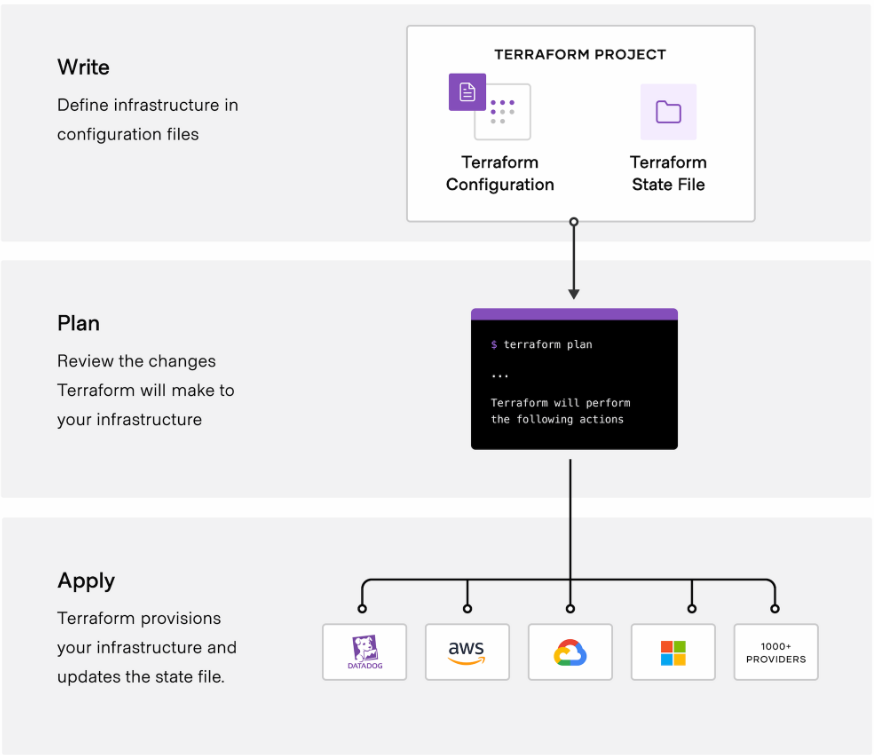
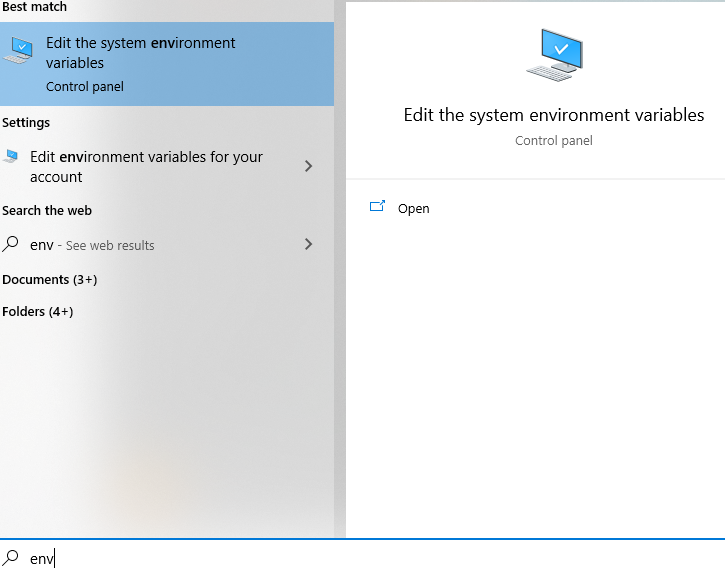
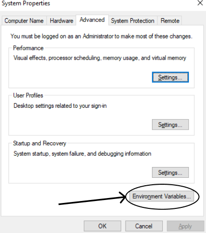
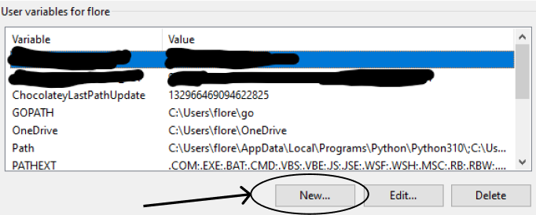
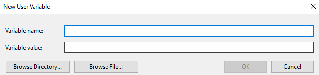
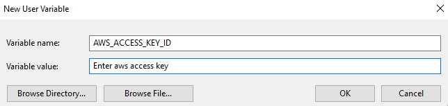
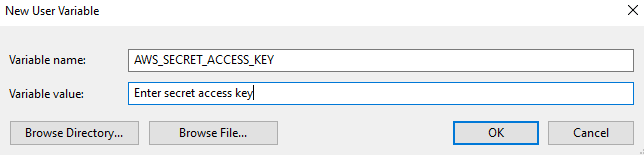

# Terraform

## Links

- [What is Terraform](#what-is-terraform)
- [How to Install Terraform](#how-to-install-terraform)
- [How does Terraform work](#how-does-terraform-work)
- [Core Terraform Workflow](#core-terraform-workflow)
- [Setting up AWS on local Machine](#setting-up-aws-on-local-machine)
- [AWS with Terraform](#aws-with-terraform)

## What is Terraform

Terraform is a IaC tool that lets you define both cloud and on-prem resources in human-readable configuration files that you can version, reuse, and share. 

## How to install Terraform

1. Open powershell in admin mode and install *chocolatey*.

```bash
Set-ExecutionPolicy Bypass -Scope Process -Force; [System.Net.ServicePointManager]::SecurityProtocol = [System.Net.ServicePointManager]::SecurityProtocol -bor 3072; iex ((New-Object System.Net.WebClient).DownloadString('https://community.chocolatey.org/install.ps1'))
```

2. Once that installation is complete, check chocolatey is install by running `choco` and if everything works you should see.

3. Once that is done, run `choco install terraform` and if everything is installed correctly, you should see this.

```bash
$ terraform
Usage: terraform [global options] <subcommand> [args]

The available commands for execution are listed below.
The primary workflow commands are given first, followed by
less common or more advanced commands.

Main commands:
  init          Prepare your working directory for other commands
  validate      Check whether the configuration is valid
  plan          Show changes required by the current configuration
  apply         Create or update infrastructure
  destroy       Destroy previously-created infrastructure

All other commands:
  console       Try Terraform expressions at an interactive command prompt
  fmt           Reformat your configuration in the standard style
  force-unlock  Release a stuck lock on the current workspace
  get           Install or upgrade remote Terraform modules
  graph         Generate a Graphviz graph of the steps in an operation
  import        Associate existing infrastructure with a Terraform resource
  login         Obtain and save credentials for a remote host
  logout        Remove locally-stored credentials for a remote host
  output        Show output values from your root module
  providers     Show the providers required for this configuration
  refresh       Update the state to match remote systems
  show          Show the current state or a saved plan
  state         Advanced state management
  taint         Mark a resource instance as not fully functional
  test          Experimental support for module integration testing
  untaint       Remove the 'tainted' state from a resource instance
  version       Show the current Terraform version
  workspace     Workspace management

Global options (use these before the subcommand, if any):
  -chdir=DIR    Switch to a different working directory before executing the
                given subcommand.
  -help         Show this help output, or the help for a specified subcommand.
  -version      An alias for the "version" subcommand.
```

## How does Terraform work

Terraform creates and manages resources on cloud platforms and other services through their application programming interfaces (APIs). Providers enable Terraform to work with virtually any platform or service with an accessible API.

## Core Terraform workflow

It consists of three stages,

- **Write** -> You define resources, which may be across multiple cloud providers and services.
- **Plan** -> Terraform creates an execution plan describing the infrastructe it will create, update, or destroy based on the existing infrastructure and your configuration.
- **Apply** -> On approval, Terraform performs the proposed operations in the correct order, respecting any resource dependencies.



## Setting up AWS on local Machine

You want to add your aws keys on your machine user environment variables.

1. Type `env` and you should see



2. Click on it, and you should then see a small box



3. Click Environment Variables



4. Click on `New` and you will be greeted with this screen



5. Enter your `AWS_ACCESS_KEY_ID` and `AWS_SECRET_ACCESS_KEY` and then once you entered the name and value, click `OK` and move onto the next key.





## AWS with Terraform

### Links

- [Launching an EC2 with Terraform](#launching-an-ec2-with-terraform)
- [Creating a VPC with Terraform](#creating-a-vpc-with-terraform)
- [Creating a public and private subnet in Terraform](#creating-a-public-and-private-subnet-in-terraform)
- [Creating a Route Table in Terraform](#creating-a-route-table-in-terraform)
- [Creating a Internet Gateway in Terraform](#creating-an-internet-gateway-in-terraform)
- [Creating a Security Group in Terraform](#creating-a-security-group-in-terraform)
- [Full Code](#full-code)

### Launching an EC2 with Terraform

This will launch a basic EC2 with default security group and VPC

```terraform
provider "aws" {

    # where do you want to create resources eu-west-1
    region = "eu-west-1"
}

# what type server - ubuntu 18.04 LTS ami
resource "aws_instance" "app_instance" {

    # size of the server - t2.micro
    ami = "ami-id"
    instance_type = "instance-type"
    key_name = "key-name-without-pem"
    # do we need it to have a public access
    associate_public_ip_address = true
    # These two automatically go to default settings
    # subnet_id = only use if you want to use customs or one you made 
    # vpc_security_group_ids = only use if you want to use customs or one you made

    # what do we want to name it
    tags = {
        Name = "eng114_florent_terraform_app"   
    }
}
```

### Creating a VPC with Terraform

This is the easiest way to create a VPC within Terraform.

This was my variable for the code below. 
```terraform
variable "vpc_cidr" {
  type        = string
  description = "The IP range to use for the VPC"
  default     = "10.0.0.0/16"
}
```

```terraform
################################# VPC
resource "aws_vpc" "vpc" {
  cidr_block = var.vpc_cidr
  instance_tenancy = "default"

  tags = {
    Name        = "${var.infra_env}-vpc"
    Environment = var.infra_env
  }
}
```

### Creating a public and private subnet in Terraform

Creating a public and private subnet 

These were my variables for public and private

```terraform
variable "public_subnet_numbers" {
  type        = map(number) # Just loops through the numbers in default and selects a zone in eu-west-1
  description = "Map of AZ to a number that should be used for public subnets"
  default = {
    "eu-west-1a" = 1
    "eu-west-1b" = 2
    "eu-west-1c" = 3
  }
}

variable "private_subnet_numbers" {
  type        = map(number) # Just loops through the numbers in default and selects a zone in eu-west-1
  description = "Map of AZ to a number that should be used for private subnets"
  default = {
    "eu-west-1a" = 4
    "eu-west-1b" = 5
    "eu-west-1c" = 6
  }
}
```

```terraform
################################# PUBLIC SUBNET
resource "aws_subnet" "public" {
  for_each = var.public_subnet_numbers # Loops through each number and zone in the default object

  vpc_id = aws_vpc.vpc.id

  // 10.0.0.0/16
  cidr_block = cidrsubnet(aws_vpc.vpc.cidr_block, 4, each.value)

  tags = {
    Name = "${var.infra_env}-public-subnet"
    Environment = var.infra_env
    Subnet = "${each.key}-${each.value}" # Selects each zone and the key it is paired with
  }
}

################################# PRIVATE SUBNET
resource "aws_subnet" "private" {
  for_each = var.private_subnet_numbers # Loops through each number and zone in the default object

  vpc_id = aws_vpc.vpc.id

  // 10.0.0.0/16
  cidr_block = cidrsubnet(aws_vpc.vpc.cidr_block, 4, each.value)

  tags = {
    Name = "${var.infra_env}-private-subnet"
    Environment = var.infra_env
    Subnet = "${each.key}-${each.value}" # Selects each zone and the key it is paired with
  }
}
```

### Creating a Route Table in Terraform

```terraform
################################# ROUTE TABLE
resource "aws_route_table" "public-route-table" {
	vpc_id = aws_vpc.vpc.id

	tags = {
		Name = "${var.infra_env}-route-table"
	}
}

################################# ROUTE FROM (PUBLIC)
resource "aws_route" "public_internet_gateway" {
	route_table_id = aws_route_table.public-route-table.id
	destination_cidr_block = "0.0.0.0/0"
	gateway_id = aws_internet_gateway.ig.id
}

resource "aws_route_table_association" "public" {
	route_table_id = aws_route_table.public-route-table.id
	subnet_id = aws_subnet.public["eu-west-1a"].id
}
```

### Creating an Internet Gateway in Terraform

```terraform
################################# INTERNET GATEWAY
resource "aws_internet_gateway" "ig" {
  vpc_id = aws_vpc.vpc.id

  tags = {
    Name = "${var.infra_env}-igw"
  }
}
```

### Creating a Security Group in Terraform

You can create multiple security groups in terraform and you can add all the ids of the security groups in the `vpc_security_group_ids` as it is an array

```terraform
resource "aws_security_group" "allow_nginx" {
  name = "allow_nginx"
  description = "Allow port 80"
  vpc_id = aws_vpc.vpc.id

  ingress {
    from_port = 80
    protocol  = "tcp"
    to_port   = 80
    cidr_blocks = [aws_vpc.vpc.cidr_block]
  }

  egress {
    from_port = 0
    protocol  = "-1"
    to_port   = 0
    cidr_blocks = ["0.0.0.0/0"]
  }

  tags = {
    Name = "allow_nginx"
  }
}
```

### Full Code

```terraform
# launch a server on aws

# who is the cloud provider AWS
provider "aws" {

# where do you want to create resources eu-west-1
  region = "eu-west-1"
}
################################# VPC
resource "aws_vpc" "vpc" {
  cidr_block = var.vpc_cidr
  instance_tenancy = "default"

  tags = {
    Name        = "${var.infra_env}-vpc"
    Environment = var.infra_env
  }
}

################################# PUBLIC SUBNET
resource "aws_subnet" "public" {
  for_each = var.public_subnet_numbers

  vpc_id = aws_vpc.vpc.id

  // 10.0.0.0/16
  cidr_block = cidrsubnet(aws_vpc.vpc.cidr_block, 4, each.value)

  tags = {
    Name = "${var.infra_env}-public-subnet"
    Environment = var.infra_env
    Subnet = "${each.key}-${each.value}"
  }
}

################################# PRIVATE SUBNET
resource "aws_subnet" "private" {
  for_each = var.private_subnet_numbers

  vpc_id = aws_vpc.vpc.id

  // 10.0.0.0/16 
  cidr_block = cidrsubnet(aws_vpc.vpc.cidr_block, 4, each.value)
  
  tags = {
    Name = "${var.infra_env}-private-subnet"
    Environment = var.infra_env
    Subnet = "${each.key}-${each.value}"
  }
}

################################# INTERNET GATEWAY
resource "aws_internet_gateway" "ig" {
  vpc_id = aws_vpc.vpc.id

  tags = {
    Name = "${var.infra_env}-igw"
  }
}

################################# ROUTE TABLE
resource "aws_route_table" "public-route-table" {
  vpc_id = aws_vpc.vpc.id

  tags = {
    Name = "${var.infra_env}-route-table" 
  }
}

################################# ROUTE FROM (PUBLIC)
resource "aws_route" "public_internet_gateway" {
  route_table_id = aws_route_table.public-route-table.id
  destination_cidr_block = "0.0.0.0/0"
  gateway_id = aws_internet_gateway.ig.id
}

resource "aws_route_table_association" "public" {
  route_table_id = aws_route_table.public-route-table.id
  subnet_id = aws_subnet.public["eu-west-1a"].id
}

resource "aws_security_group" "allow_nginx" {
  name = "allow_nginx"
  description = "Allow port 80"
  vpc_id = aws_vpc.vpc.id

  ingress {
    from_port = 80
    protocol  = "tcp"
    to_port   = 80
    cidr_blocks = [aws_vpc.vpc.cidr_block]
  }

  egress {
    from_port = 0
    protocol  = "-1"
    to_port   = 0
    cidr_blocks = ["0.0.0.0/0"]
  }

  tags = {
    Name = "allow_nginx"
  }
}

# what type server - ubuntu 18.04 LTS ami
resource "aws_instance" "app_instance" {

    # size of the server - t2.micro
    ami = "ami-id"
    instance_type = "instance-type"
    key_name = "key-name-without-pem"
    # do we need it to have a public access
    associate_public_ip_address = true
    # These two automatically go to default settings
    # subnet_id = only use if you want to use customs or one you made 
    # vpc_security_group_ids = only use if you want to use customs or one you made
    
    # what do we want to name it
    tags = {
        Name = "eng114_florent_terraform_app"   
    }
}
```
